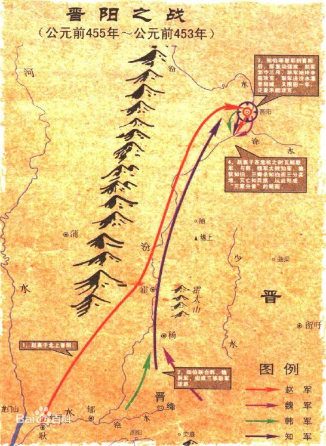
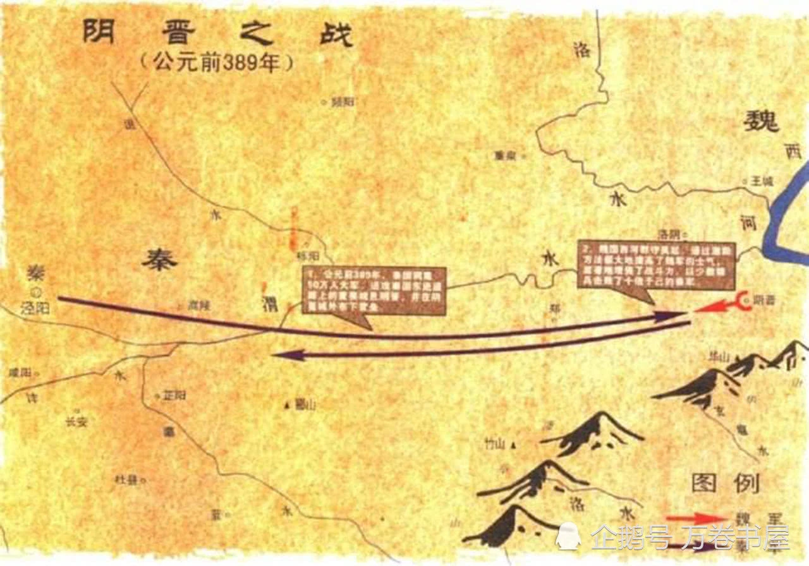
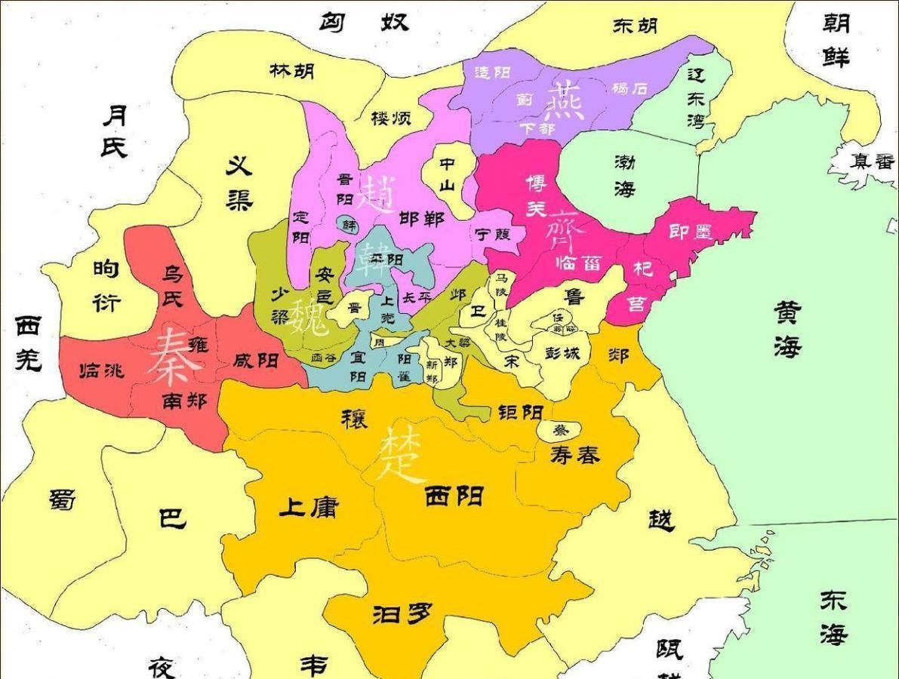
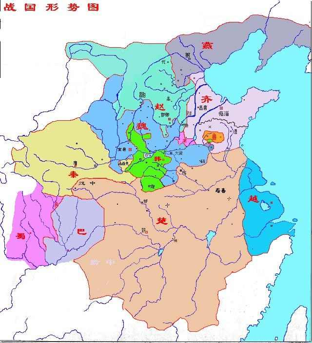

# 周纪 第一章 周纪一

---

起着雍摄提格^*^，尽玄黓困敦，凡三十五年。

::: note
起于戊寅年，尽于壬子年，总共三十五年。见：https://zhidao.baidu.com/question/41852788.html
:::

---

# 威烈王

---

## 二十三年（戊寅，公元前四零三年）

---

初命晋大夫魏斯、赵籍、韩虔为诸侯。

---

> 臣光曰：臣闻天子之职莫大于礼，礼莫大于分，分莫大于名。何谓礼？纪纲是也；何谓分？君臣是也；何谓名？公、侯、卿、大夫是也。夫以四海之广，兆民之众，受制于一人，虽有绝伦之力，高世之智，莫敢不奔走而服役者，岂非以礼为之纲纪哉！是故天子统三公，三公率诸侯，诸侯制卿大夫，卿大夫治士庶人。贵以临贱，贱以承贵。上之使下，犹心腹之运手足，根本之制支叶；下之事上，犹手足之卫心腹，支叶之庇本根。然后能上下相保而国家治安。故曰：_天子之职莫大于礼也_。

---

> 文王序《易》，以乾坤为首。孔子系之曰：__「天尊地卑，乾坤定矣，卑高以陈，贵贱位矣。」__ 言君臣之位，犹天地之不可易也。《春秋》抑诸侯，尊周室，王人虽微，序于诸侯之上，以是见圣人于君臣之际，未尝不 惓惓 也。非有桀、纣之暴，汤、武之仁，人归之，天命之，君臣之分，当守节伏死而已矣。是故以微子而代纣，则成汤配天矣；以季札而君吴，则太伯血食矣。然二子宁亡国而不为者，诚以礼之大节不可乱也。故曰：_礼莫大于分也_。

*[惓惓]: 谨慎、诚恳的意思，在这里要结合这句话前面的语句「《春秋》抑诸侯，尊王室，王人虽微，序于诸侯之上」，我们可以翻译成「严谨对待」

---

> 夫礼，辨贵贱，序亲疏，裁群物，制庶事。非名不着，非器不形。名以命之，器以别之，然后上下粲然有伦，此礼之大经也。名器既亡，则礼安得独在哉？昔仲叔于奚有功于卫，辞邑而请繁缨，孔子以为不如多与之邑。惟器与名，不可以假人，君之所司也。政亡，则国家从之。卫君待孔子而为政，孔子欲先正名，以为名不正则民无所措手足。夫繁缨，小物也，而孔子惜之；正名，细务也，而孔子先之。诚以名器既乱，则上下无以相有故也。夫事未有不生于微而成于着。圣人之虑远，故能谨其微而治之；众人之识近，故必待其着而后救之。治其微，则用力寡而功多；救其着，则竭力而不能及也。《易》曰：__「履霜，坚冰至」__ ，《书》曰：__「一日二日万几」__ ，谓此类也。故曰：_分莫大于名也_。

---

> 呜呼！幽、厉失德，周道日衰，纲纪散坏，下陵上替，诸侯专征，大夫擅政。礼之大体，什丧七八矣。然文、武之祀犹绵绵相属者，盖以周之子孙尚能守其名分故也。何以言之？昔晋文公有大功于王室，请隧于襄王，襄王不许，曰：__「王章也。未有代德而有二王，亦叔父之所恶也。不然，叔父有地而隧，又何请焉！」__ 文公于是乎惧而不敢违。是故以周之地则不大于曹、滕，以周之民则不众于邾、莒，然历数百年，宗主天下，虽以晋、楚、齐、秦之强，不敢加者，何哉？徒以名分尚存故也。至于季氏之于鲁，田常之于齐，白公之于楚，智伯之于晋，其势皆足以逐君而自为，然而卒不敢者，岂其力不足而心不忍哉？乃畏奸名犯分而天下共诛之也。

---

> 晋大夫暴蔑其君，剖分晋国，天子既不能讨，又宠秩之，使列于诸侯，是区区之名分复不能守而并弃之也。先王之礼于斯尽矣。或者以为当是之时，周室微弱，三晋强盛，虽欲勿许，其可得乎？是大不然。夫三晋虽强，苟不顾天下之诛而犯义侵礼，则不请于天子而自立矣。不请于天子而自立，则为悖逆之臣。天下苟有桓、文之君，必奉礼义而征之。今请于天子而天子许之，是受天子之命而为诸侯也，谁得而讨之！故三晋之列于诸侯，非三晋之坏礼，乃天子自坏之也。

---

> 呜呼！君臣之礼既坏矣，则天下以智力相雄长，遂使圣贤之后为诸侯者，社稷无不泯绝，生民之害糜灭几尽，岂不哀哉！

---

初，智宣子将以瑶为后。智果曰：__「不如宵也。瑶之贤于人者五，其不逮者一也。美鬓长大则贤，射御足力则贤，伎艺毕给则贤，巧文辩慧则贤，强毅果敢则贤，如是而甚不仁。夫以其五贤陵人，而以不仁行之，其谁能待之？若果立瑶也，智宗必灭。」__ 弗听，智果别族于太史为辅氏。赵简子之子，长曰伯鲁，幼曰无恤。将置后，不知所立。乃书训戒之辞于二简，以授二子曰：__「谨识之。」__ 三年而问之，伯鲁不能举其辞，求其简，已失之矣。问无恤，诵其辞甚习，求其简，出诸袖中而奏之。于是简子以无恤为贤，立以为后。简子使 尹铎 为晋阳。请曰：__「以为茧丝乎？抑为保障乎？」__ 简子曰：__「保障哉！」__ 尹铎 损其户数。简子谓无恤曰：__「晋国有难，而无以 尹铎 为少，无以晋阳为远，必以为归。」__

*[尹铎]: yǐn duó，少昊的后裔，晋卿赵鞅的家臣。

---

及智宣子卒，智襄子为政，与韩康子、魏桓子宴于蓝台。智伯戏康子而侮段规，智国闻之，谏曰：__「主不备，难必至矣！」__ 智伯曰：__「难将由我。我不为难，谁敢兴之？」__ 对曰：__「不然。《夏书》有之曰：‘一人三失，怨岂在明，不见是图。’夫君子能勤小物，故无大患。今主一宴而耻人之君相，又弗备，曰不敢兴难，无乃不可乎！蜹、蚁、蜂、虿，皆能害人，况君相乎！」__ 弗听。

*[蜹]: ruì，指蠛 miè 蠓 měng，"醯酸而蠛蠓聚焉。" 《荀子 劝学篇》；古同「蚋」："蚋蚁蜂虿，皆能害人。"

---

智伯请地于韩康子，康子欲弗与。段规曰：__「智伯好利而愎，不与，将伐我；不如与之。彼 狃 于得地，必请于他人；他人不与，必向之以兵。然则我得免于患而待事之变矣。」__ 康子曰：__「善。」__ 使使者致万家之邑于智伯，智伯悦。又求地于魏桓子，桓子欲弗与。任章曰：__「何故弗与？」__ 桓子曰：__「无故索地，故弗与。」__ 任章曰：__「无故索地，诸大夫必惧；吾与之地，智伯必骄。彼骄而轻敌，此惧而相亲。以相亲之兵待轻敌之人，智氏之命必不长矣。《周书》曰：‘_将欲败之，必姑辅之；将欲取之，必姑与之_。’主不如与之以骄智伯，然后可以择交而图智氏矣。奈何独以吾为智氏质乎！」__ 桓子曰：__「善。」__ 复与之万家之邑一。智伯又求蔡、皋狼之地于赵襄子，襄子弗与。智伯怒，帅韩、魏之甲以攻赵氏。

*[狃]: niǔ，习以为常

---

子将出，曰：__「吾何走乎？」__ 从者曰：__「长子近，且城厚完。」__ 襄子曰：__「民罢力以完之，又毙死以守之，其谁与我！」__ 从者曰：__「邯郸之仓库实。」__ 襄子曰：__「浚民之膏泽以实之，又因而杀之，其谁与我！其晋阳乎，先主之所属也，尹铎 之所宽也，民必和矣。」__ 乃走晋阳。

---

三家以国人围而灌之，城不浸者三版。沈灶产蛙，民无叛意。智伯行水，魏桓子御，韩康子骖乘。智伯曰：__「吾乃今知水可以亡人国也。」__ 桓子肘康子，康子履桓子之跗，以汾水可以灌安邑，绛水可以灌平阳也。絺疵 谓智伯曰：__「韩、魏必反矣。」__ 智伯曰：__「子何以知之？」__ 絺疵 曰：__「以人事知之。夫从韩、魏之兵以攻赵，赵亡，难必及韩、魏矣。今约胜赵而三分其地，城不没者三版，人马相食，城降有日，而二子无喜志，有忧色，是非反而何？」__ 明日，智伯以 絺疵 之言告二子，二子曰：__「此夫谗臣欲为赵氏游说，使主疑于二家而懈于攻赵氏也。不然，夫二家岂不利朝夕分赵氏之田，而欲为危难不可成之事乎？」__ 二子出，絺疵 入曰：__「主何以臣之言告二子也？」__ 智伯曰：__「子何以知之？」__ 对曰：__「臣见其视臣端而趋疾，知臣得其情故也。

*[絺疵]: chī cī，春秋时晋国人，善谋。为智伯（智瑶）谋士，献计削弱赵、魏、韩三家，从而使智氏一家独大。

---

智伯不悛。絺疵 请使于齐。

---

赵襄子使张孟谈潜出见二子，曰：__「臣闻唇亡则齿寒。今智伯帅韩、魏而攻赵，赵亡则韩、魏为之次矣。」__ 二子曰：__「我心知其然也，恐事末遂而谋泄，则祸立至矣」__ 。张孟谈曰：__「谋出二主之口，入臣之耳，何伤也？」__ 二子乃阴与张孟谈约，为之期日而遣之。襄子夜使人杀守堤之吏，而决水灌智伯军。智伯军救水而乱，韩、魏翼而击之，襄子将卒犯其前，大败智伯之众。遂杀智伯，尽灭智氏之族。唯辅果在。

---

> 臣光曰：智伯之亡也，才胜德也。夫才与德异，而世俗莫之能辨，通谓之贤，此其所以失人也。夫聪察强毅之谓才，正直中和之谓德。才者，德之资也；德者，才之帅也。云梦之竹，天下之劲也，然而不矫揉，不羽括，则不能以入坚；棠溪之金，天下之利也，然而不熔范，不砥砺，则不能以击强。是故才德全尽谓之圣人，才德兼亡谓之愚人，德胜才谓之君子，才胜德谓之小人。凡取人之术，苟不得圣人、君子而与之，与其得小人，不若得愚人。何则？君子挟才以为善，小人挟才以为恶。挟才以为善者，善无不至矣；挟才以为恶者，恶亦无不至矣。愚者虽欲为不善，智不能周，力不能胜，譬之乳狗搏人，人得而制之。小人智足以遂其奸，勇足以决其暴，是虎而翼者也，其为害岂不多哉！夫德者人之所严，而才者人之所爱。

---

> 爱者易亲，严者易疏，是以察者多蔽于才而遗于德。自古昔以来，国之乱臣，家之败子，才有余而德不足，以至于颠覆者多矣，岂特智伯哉！故为国为家者，苟能审于才德之分而知所先后，又何失人之足患哉！

---

三家分智氏之田。赵襄子漆智伯之头，以为饮器。智伯之臣豫让欲为之报仇，乃诈为刑人，挟匕首，入襄子宫中涂厕。襄子如厕心动，索之，获豫让。左右欲杀之，襄子曰：__「智伯死无后，而此人欲为报仇，真义士也！吾谨避之耳。」__ 乃舍之。豫让又漆身为 癞，吞炭为哑，行乞于市，其妻不识也。行见其友，其友识之，为之泣曰：__「以子之才，臣事赵孟，必得近幸。子乃为所欲为，顾不易邪？何乃自苦如此！求以报仇，不亦难乎？」__ 豫让曰：__「不可！既已委质为臣，而又求杀之，是二心也。凡吾所为者，极难耳。然所以为此者，将以愧天下后世之为人臣怀二心者也。」__ 襄子出，豫让伏于桥下。襄子至桥，马惊，索之，得豫让，遂杀之。襄子为伯鲁之不立也，有子五人，不肯置后。封伯鲁之子于代，曰代成君，早卒，立其子浣为赵氏后。

*[癞]: lài，病名。即疠风。亦称大风，恶疾，指麻风病。疠通癞。

---

子卒，弟桓子逐浣而自立，一年卒。赵氏之人曰：__「桓子立，非襄主意。」__ 乃共杀其子，复迎浣而立之，是为献子。献子生籍，是为烈侯。魏斯者，桓子之孙也，是为文侯。韩康子生武子，武子生虔，是为景侯。

---

魏文侯以卜子夏、田子方为师，每过段干木之庐必式。四方贤士多归之。文侯与群臣饮酒，乐，而天雨，命驾将适野。左右曰：__「今日饮酒乐，天又雨，君将安之？」__ 文侯曰：__「吾与虞人期猎，虽乐，岂可无一会期哉！」__ 乃往，身自罢之。韩借师于魏以伐赵。文侯曰：__「寡人与赵，兄弟也，不敢闻命。」__ 赵借师于魏以伐韩，文侯应之亦然。二国皆怒而去。已而知文侯以讲于己也，皆朝于魏。魏由是始大于三晋，诸侯莫能与之争。使乐羊伐中山，克之，以封其子击。文侯问于群臣曰：__「我何如主？」__ 皆曰：__「仁君。」__ 任座曰：__「君得中山，不以封君之弟而以封君之子，何谓仁君？」__ 文侯怒，任座趋出。次问翟璜，对曰：__「仁君也。」__ 文侯曰：__「何以知之？」__ 对曰：__「臣闻君仁则臣直。向者任座之言直，臣是以知之。」__

---

文侯悦，使翟璜召任座而反之，亲下堂迎之，以为上客。文侯与田子方饮，文侯曰：__「钟声不比乎？左高。」__ 田子方笑。文侯曰：__「何笑？」__ 子方曰：__「臣闻之，君明乐官，不明乐音。今君审于音，臣恐其聋于官也。」__ 文侯曰：__「善。」__ 子击出，遭田子方于道，下车伏谒。子方不为礼。子击怒，谓子方曰：__「富贵者骄人乎？贫贱者骄人乎？」__ 子方曰：__「亦贫贱者骄人耳，富贵者安敢骄人？国君而骄人则失其国，大夫而骄人则失其家。失其国者未闻有以国待之者也，失其家者未闻有以家待之者也。夫士贫贱者，言不用，行不合，则纳履而去耳，安往而不得贫贱哉！」__ 子击乃谢之。文侯谓李克曰：__「先生尝有言曰：‘家贫思良妻，国乱思良相。’今所置非成则璜，二子何如？」__ 对曰：__「卑不谋尊，疏不谋戚。臣在阙门之外，不敢当命。」__

---

文侯曰：__「先生临事勿让。」__ 克曰：__「君弗察故也。_居视其所亲，富视其所与，达视其所举，穷视其所不为，贫视其所不取_，五者足以定之矣，何待克哉！」__ 文侯曰：__「先生就舍，吾之相定矣。」__ 李克出，见翟璜。翟璜曰：__「今者闻君召先生而卜相，果谁为之？」__ 克曰：__「魏成。」__ 翟璜忿然作色曰：__「西河守吴起，臣所进也；君内以邺为忧，臣进西门豹；君欲伐中山，臣进乐羊；中山已拔，无使守之，臣进先生；君之子无傅，臣进屈侯鲋。以耳目之所睹记，臣何负于魏成？」__ 李克曰：__「子之言克于子之君者，岂将比周以求大官哉？君问相于克，克之对如是。所以知君之必相魏成者，魏成食禄千钟，什九在外，什一在内，是以东得卜子夏、田子方、段干木。此三人者，君皆师之；子所进五人者，君皆臣之。恶得与魏成比也！」__ 翟璜 逡巡^*^ 再拜曰：__「璜，鄙人也，失对，愿卒为弟子。」__

::: note
逡巡：一指徘徊不进；滞留,二指拖延，迁延，三指迟疑；犹豫，四指小心谨慎，五指退避；退让，六指从容；不慌忙，七指倒退而行行，恭顺的样子，八指顷刻；极短时间，九指月晕
:::
---

吴起者，卫人，仕于鲁。齐人伐鲁，鲁人欲以为将，起取齐女为妻，鲁人疑之，起杀妻以求将，大破齐师。或谮之鲁侯曰：__「起始事曾参，母死不奔丧，曾参绝之。今又杀妻以求为君将。起，残忍薄行人也。且以鲁国区区而有胜敌之名，则诸侯图鲁矣。」__ 起恐得罪。闻魏文侯贤，乃往归之。文侯问诸李克，李克曰：__「起贪而好色，然用兵，司马穰苴^*^ 弗能过也。」__ 于是文侯以为将，击秦，拔五城。起之为将，与士卒最下者同衣食，卧不设席，行不骑乘，亲裹赢粮，与士卒分劳苦。卒有病疽者，起为吮之。卒母闻而哭之。人曰：__「子，卒也，而将军自吮其疽，何哭为？」__ 母曰：__「非然也。往年吴公吮其父，其父战不还踵，遂死于敌。吴公今又吮其子，妾不知其死所矣，是以哭之。」__

::: note
司马穰苴: 又称田穰 ráng 苴 jū（生卒不详），春秋末期齐国人，是田完（陈完）的后代，齐田氏家族的支庶。田穰苴是继姜尚之后一位承上启下的著名军事家，曾率齐军击退晋、燕入侵之军，因功被封为大司马，子孙后世称司马氏。后因齐景公听信谗言，田穰苴被罢黜，未几抑郁发病而死。由于年代久远，其事迹流传不多，但其军事思想却影响巨大
:::

---

燕湣公薨，子僖公立。

---

## 二十四年（己卯，公元前四零二年）

---

王崩，子安王骄立。

---

盗杀楚声王，国人立其子悼王。

---

# 安王

---

## 元年（庚辰，公元前四零一年）

---

秦伐魏，至阳狐。

---

## 二年（辛巳，公元前四零零年）

---

魏、韩、赵伐楚，至桑丘。

---

郑围韩阳翟。

---

韩景侯薨，子烈侯取立。

---

赵烈侯薨，国人立其弟武侯。

---

秦简公薨，子惠公立。

---

## 三年（壬午，公元前三九九年）

---

### 王子定奔晋。

---

虢山崩，壅河。

---

## 四年（癸未，公元前三九八年）

---

楚围郑。郑人杀其相驷子阳。

---

## 五年（甲申，公元前三九七年）

---

日有食之。

---

三月，盗杀韩相侠累。侠累与濮阳严仲子有恶。仲子闻轵人聂政之勇，以黄金百镒为政母寿，欲因以报仇。政不受，曰：__「老母在，政身未敢以许人也！」__ 及母卒，仲子乃使政刺侠累。侠累方坐府上，兵卫甚众，聂政直入上阶，刺杀侠累，因自皮面抉眼，自屠出肠。韩人暴其尸于市，购问，莫能识。其姊嫈^*^闻而往哭之，曰：__「是轵深井里聂政也。以妾尚在之故，重自刑以绝从。妾奈何畏殁身之诛，终灭贤弟之名！」__ 遂死于政尸之旁。

::: note
嫈: yīng。1. 小心的样子。2. 嫈嫇 mínɡ，娇羞貌。如 "春游轹靃靡，彩伴飒嫈嫇" 3. 好。
:::

---

## 六年（乙酉，公元前三九六年）

---

郑驷子阳之党弑繻公，而立其弟乙，是为康公。

---

宋悼公薨，子休公田立。

---

## 八年（丁亥，公元前三九四年）

---

齐伐鲁，取最。韩救鲁。

---

郑负黍叛，复归韩。

---

## 九年（戊子，公元前三九三年）

---

魏伐郑。

---

晋烈公薨，子孝公倾立。

---

## 十一年（庚寅，公元前三九一年）

---

秦伐韩宜阳，取六邑。

---

初，田常生襄子盘，盘生庄子白，白生太公和。是岁，田和迁齐康公于海上，使食一城，以奉其先祀。

---

## 十二年（辛卯，公元前三九零年）

---

秦、晋战于武城。

---

齐伐魏，取襄阳。

---

鲁败齐师于平陆。

---

## 十三年（壬辰，公元前三八九年）

---

秦侵晋^1^。

::: note
在《吴子 励士 第六》中有这样两段文字：“行之三年，秦人兴师，临于西河，魏士闻之，不待吏令，介胄而奋击之者，以万数。”，“于是武侯从之。兼车五百乘，骑三千匹，而破秦五十万众。”区区52个字，记录了阴晋之战的经过。
:::

---

齐田和会魏文侯、楚人、卫人于浊泽，求为诸侯。魏文侯为之请于王及诸侯，王许之。

---

## 十五年（甲午，前三八七年）

---

秦伐蜀，取南郑。

---

魏文侯薨，太子击立，是为武侯。

---

武侯浮西河而下，中流顾谓吴起曰：__「美哉山河之固，此魏国之宝也！」__ 对曰：__「在德不在险。昔三苗氏，左洞庭，右彭蠡，德义不修，禹灭之；夏桀之居，左河济，右泰华，伊阙在其南，羊肠在其北，修政不仁，汤放之；商纣之国，左孟门，右太行，常山在其北，大河经其南，修政不德，武王杀之。由此观之，在德不在险。若君不修德，舟中之人皆敌国也。」__ 武侯曰：__「善。」__ 魏置相，相田文。吴起不悦，谓田文曰：__「请与子论功，可乎？」__ 田文曰：__「可。」__ 起曰：__「将三军，使士卒乐死，敌国不敢谋，子孰与起？」__ 文曰：__「不如子。」__ 起曰：__「治百官，亲万民，实府库，子孰与起？」__ 文曰：__「不如子。」__ 起曰：__「守西河而秦兵不敢东乡，韩、赵宾从，子孰与起？」__ 文曰：__「不如子。」__

---

起曰：__「此三者子皆出吾下，而位加吾上，何也？」__ 文曰：__「主少国疑，大臣未附，百姓不信，方是之时，属之子乎，属之我乎？」__ 起默然良久，曰：__「属之子矣。」__ 久之，魏相公叔尚魏公主而害吴起。公叔之仆曰：__「起易去也。起为人刚劲自喜，子先言于君曰：‘吴起，贤人也，而君之国小，臣恐起之无留心也，君盍试延以女？起无留心，则必辞矣。’子因与起归而使公主辱子，起见公主之贱子也，必辞，则子之计中矣。」__ 公叔从之，吴起果辞公主。魏武侯疑之而未信，起惧诛，遂奔楚。楚悼王素闻其贤，至则任之为相。起明法审令，捐不急之官，废公族疏远者，以抚养战斗之士，要在强兵，破游说之言从横者。于是南平百越，北却三晋，西伐秦，诸侯皆患楚之强，而楚之贵戚大臣多怨吴起者。

---

秦惠公薨，子出公立。

---

赵武侯薨，国人复立烈侯之太子章，是为敬侯。

---

韩烈侯薨，子文侯立。

---

## 十六年（乙未，公元前三八六年）

---

初命齐大夫田和为诸侯。

---

赵公子朝作乱，出奔魏，与魏袭邯郸，不克。

---

## 十七年（丙申，公元前三八五年）

---

秦庶长改逆献公于河西而立之；杀出子及其母，沉之渊旁。

---

齐伐鲁。

---

韩伐郑，取阳城；伐宋，执宋公。

---

齐太公薨，子桓公午立。

---

## 十九年（戊戌，公元前三八三年）

---

魏败赵师于兔台。

---

## 二十年（己亥，公元前三八二年）

---

日有食之，既。

---

## 二十一年（庚子，公元前三八一年）

---

楚悼王薨，贵戚大臣作乱，攻吴起，起走之王尸而伏之。击起之徒因射刺起，并中王尸。既葬，肃王即位。使令尹尽诛为乱者，坐起夷宗者七十余家。

---

## 二十二年（辛丑，公元前三八零年）

---

齐伐燕，取桑丘。魏、韩、赵伐齐，至桑丘。

---

## 二十三年（壬寅，公元前三七九年）

---

赵袭卫，不克。

---

齐康公薨，无子，田氏遂并齐而有之。

---

是岁，齐桓公亦薨，子威王因齐立。

---

## 二十四年（癸卯，公元前三七八年）

---

狄败魏师于浍。

---

魏、韩、赵伐齐，至灵丘。

---

晋孝公薨，子靖公俱酒立。

---

## 二十五年（甲辰，公元前三七七年）

---

蜀伐楚，取兹方。

---

子思言苟变于卫侯曰：__「其材可将五百乘。」__ 公曰：__「吾知其可将。然变也尝为吏，赋于民而食人二鸡子，故弗用也。」__ 子思曰：__「_夫圣人之官人，犹匠之用木也，取其所长，弃其所短_。故杞梓连抱而有数尺之朽，良工不弃。今君处战国之世，选爪牙之士，而以二卵弃干城之将，此不可使闻于邻国也。」__ 公再拜曰：__「谨受教矣。」__ 卫侯言计非是，而群臣和者如出一口。子思曰：__「以吾观卫，所谓‘君不君，臣不臣’者也。」__ 公丘懿子曰：__「何乃若是？」__ 子思曰：__「_人主自臧，则众谋不进_。事是而臧之，犹却众谋，况和非以长恶乎！夫 _不察事之是非而悦人赞己，暗莫甚焉；不度理之所在而阿谀求容，谄莫甚焉_。君暗臣谄，以居百姓之上，民不与也。引不已，国无类矣！」__ 子思言于卫侯曰：__「君之国事将日非矣！」__ 公曰：__「何故？」__ 对曰：__「有由然焉。_君出言自以为是，而卿大夫莫敢矫其非；卿大夫出言亦自以为是，而士庶人莫敢矫其非。君臣既自贤矣，而群下同声贤之，贤之则顺而有福，矫之则逆而有祸，如此则善安从生！_《诗》曰：‘具曰予圣，谁知乌之雌雄？’抑亦似君之君臣乎？」__

---

鲁穆公薨，子共公奋立。

---

韩文侯薨，子哀侯立。

---

## 二十六年（乙巳，公元前三七六年）

---

王崩，子烈王喜立。魏、韩、赵共废晋靖公为家人而分其地。

---

# 烈王

---

## 元年（丙午，公元前三七五年）

---

日有食之。

---

韩灭郑^*^，因徒都之。

::: note
据《战国策·韩策》记载：韩、赵、魏三家已经打败智伯，准备瓜分他的土地。韩相段规对韩康子说：“分地时一定要成皋。”韩康子说：“成皋是贫瘠不长庄稼的地方，要它有什么用？”段规说：“一里那么大的地盘却可以牵动方圆千里的政权，是因为地形有利的缘故。一万人可以打败三军，是因为乘敌人不备的缘故。大王如果能采纳我的意见，韩国一定可以消灭郑国。”韩康子说：“好。”果然要了成皋。到后来韩国灭亡郑国时，果然是从成皋开始的。
:::

---

赵敬侯薨，子成侯种立。

---

## 三年（戊申，公元前三七三年）

---

燕败齐师于林狐。

---

鲁伐齐，入阳关。

---

魏伐齐，至博陵。

---

燕僖公薨，子辟公立。

---

宋休公薨，子桓公立。

---

卫慎公薨，子声公训立。

---

## 四年（己酉，公元前三七二年）

---

赵伐卫，取都鄙七十三。

---

魏败赵师于北蔺。

---

## 五年（庚戌，公元前三七一年）

---

魏伐楚，取鲁阳。

---

韩严遂弑哀侯，国人立其子懿侯。初，哀侯以 韩廆 为相而爱严遂，二人甚相害也。严遂令人刺 韩廆 于朝，廆走哀侯，哀侯抱之。人刺 韩廆，兼及哀侯。

*[韩廆]: wěi。韩傀（？—前397年），字侠累，通称侠累。是战国初期韩国贵族，韩景侯的弟弟，韩烈侯的叔父。

---

魏武侯薨，不立太子，子 与公中缓争立，国内乱。

---

## 六年（辛亥，公元前三七零年）

---

齐威王来朝。是时周室微弱，诸侯莫朝，而齐独朝之，天下以此益贤威王。

---

赵伐齐，至鄄。

---

魏败赵师于怀。

---

齐威王召即墨大夫，语之曰：__「自子之居即墨也，毁言日至。然吾使人视即墨，田野辟，人民给，官无事，东方以宁。是子不事吾左右以求助也。」__ 封之万家。召阿大夫，语之曰：__「自子守阿，誉言日至。吾使人视阿，田野不辟，人民贫馁。昔日赵攻鄄，子不救；卫取薛陵，子不知。是子厚币事吾左右以求誉也。」__ 是日，烹阿大夫及左右尝誉者。于是群臣耸惧，莫敢饰诈，务尽其情，齐国大治，强于天下。

---

楚肃王薨，无子，立其弟良夫，是为宣王。

---

宋辟公薨，子剔成立。

---

## 七年（壬子，公元前三六九年）

---

日有食之。

---

王崩，弟扁立，是为显王。

---

魏大夫王错出奔韩。公孙颀谓韩懿侯曰：__「魏乱，可取也。」__ 懿侯乃与赵成侯合兵伐魏，战于浊泽^*^，大破之，遂围魏。成侯曰：__「杀 罃，立公中缓，割地而退，我二国之利也。」__ 懿侯曰：__「不可。杀魏君，暴也；割地而退，贪也。不如两分之。魏分为两，不强于宋、卫，则我终无魏患矣。」__ 赵人不听。懿侯不悦，以其兵夜去。赵成侯亦去。 遂杀公中缓而立，是为惠王。

*[罃]: yīng，备火长颈缾也。子罃，魏惠王。

::: note
在削弱魏国的方法上，赵国要得实利以削弱魏国；韩国则要得名声以削弱魏国。最终二者没有达成一致，放过了魏国。浊泽之战让三晋联盟土崩瓦解。
:::

---

> 太史公曰：魏惠王之所以身不死，国不分者，二国之谋不和也。若从一家之谋，魏必分矣。故曰：__「君终，无适子，其国可破也。」__
